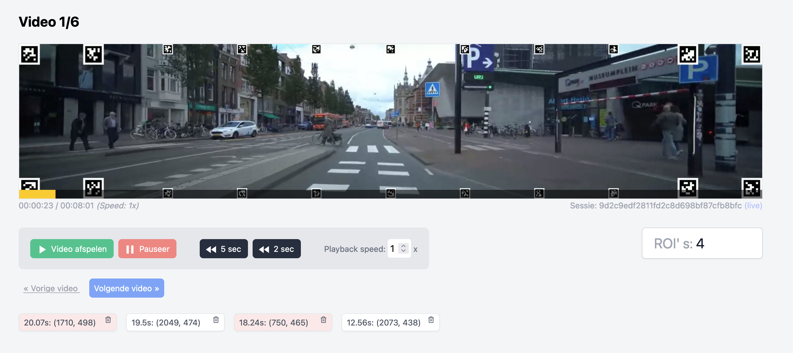

# Marking AOIs

The goal of this part of the HPT toolset is to let experts identify **MUST** and **MAY** be seen Areas Of Interest. This folder contains a Laravel web-applicaton and should be uploaded to a web server to function properly.

> A demo can be found on: https://hpt.joriswvanrijn.com/



_screenshot 1_

## Usage

1. When opening the application, users will be prompted to fill in user identifying information (screenshot 2). This information will be stored in a session so that users may continue the excersise later in time.
1. On continuing, an introduction and instruction will be given (screenshot 3 & screenshot 4).
1. After this, the user will be presented with a demo video. The purpose of this video is to get a grasp of the interface and the task at hand. (screenshot 5)
1. On continuing, the first video will open, on which users may indicate MUST and MAY be seen Areas Of Interest. Users can control the flow of the video (speed, rewind, etc). Clicks = May be seen. Shift + click = Must be seen.
1. After clicking, the samples will be collected in a list under the video. Users may remove samples here. (screenshot 1). Users may continue to the next video and return to a previous video at any time.
1. Both the user session information and the clicks on the video are stored in files (no database required). These files may be downloaded from the webserver. Aditionally, the files can be seen from a simple web interface (`{website}/list`, e.g. https://hpt.joriswvanrijn.com/list) and the videos can be replayed, with clicks overlayed (screenshot 6).

**Notes:**

-   Data files will be saved to `./storage/app/public/data/`
-   Log files can be found in `./storage/app/logs/`
-   Videos should be stored in `./storage/app/public/videos/`
-   The web interface to replay videos and see session information can be found on `{website}/list`

## Screenshots


_screenshot 2_


_screenshot 3_


_screenshot 4_


_screenshot 5_


_screenshot 6_

## Requirements

-   PHP webserver (deployment)
-   NB: A database is **not** required
-   Composer (development)
-   Node/npm (development)

## Installation

```sh
# Get the code
git clone git@github.com:treyescan/marking-aois.git

# Include the videos to ./storage/app/public/videos/
cp *.webm ./storage/app/public/videos/

# Copy and edit the environment file, make sure to set NUMBER_VIDEOS and APP_URL
cp .env.example .env
```

> For optimal usage, browsers require videos to be compressed to .webm format. This can be easily done using [ffmpeg](https://ffmpeg.org/) with this command: `ffmpeg -i source.mp4 -c:v libvpx-vp9 -b:v 1M -c:a libopus -b:a 128k target.webm`. In this interface, the first frame in the video will be paused. To clarify this for the user, we have edited "Tap spacebar to start the video" onto the videos themselves.

## Development

**To run locally:**

```sh
# Install PHP dependencies
composer install

# Run a local instance (localhost)
php artisan serve
```

**To develop locally:**

```sh
# Install JS/CSS/HTML dependencies
npm install

# Build the assets
npm run dev
npm run watch # alternatively: build assets and watch for changes

# Run a local instance (localhost)
php artisan serve
```

## Deployment

To deploy this Laravel application, follow the steps in [Installation](#installation) first. After that, refer to the official Laravel documentation for a [deployment guide](https://laravel.com/docs/9.x/deployment).

## Citation

## Contribution

[Issues](https://github.com/treyescan/marking-aois/issues/new) and other contributions are welcome.

## License

This toolkit is licensed under [GNU GENERAL PUBLIC LICENSE V3](/LICENSE)
